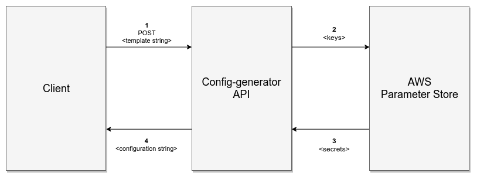

Config Generator
===

[](https://travis-ci.org/ChristopheCluizel/config-generator)
[](https://opensource.org/licenses/MIT)

## Description
The Config Generator service is an API which generates a configuration file based on a template and secrets. The goal is to be able to commit a configuration template without secret and store those secrets on AWS Parameter Store service. The Config Generator will retrieve those secrets to fill the template and generate the complete configuration file.



Service execution and tests are Dockerised, therefore only Docker and Docker-compose are required to run and test this service.

### Authorization & environment variables
The Config generator service needs environment variables like AWS keys and region. Those variables are passed to the Docker container through different manners and become environment variables in this container.

#### Local API use
The 3 following variables are passed to the container thanks to the *.env* file:
* AWS keys (access key & secret key)
* AWS region

#### Travis CI
Travis is used as a CI. The 3 following variables are passed to the container thanks to the Travis settings panel:
* AWS keys (access key & secret key)
* AWS region

You can create specific AWS keys for your CI to easily revoke them if needed.

#### Remote API
When you deploy the Config generator service, it is better to avoid putting your AWS keys on the server. Prefer to attached an AWS role to your server instance. The following variable is passed to the container thanks to the *.env* file:
* AWS region

### Template format
The configuration template must follow the Python Jinja2 format (http://jinja.pocoo.org/docs/2.10/). Below a configuration template example.

```ini
REDSHIFT = {
"user": "{{ redshift_user }}",
"pwd" : "{{ redshift_pwd }}",
"host" : "{{ redshift_host }}",
"port" : "{{ redshift_port }}",
"name" : "{{ redshift_name }}"
}

DEPLOYMENT_VAR = {
"client": "client1",
"environment": "dev"
}
```
The *DEPLOYMENT_VAR* variables can easily be committed as they are not secret. However all the variable under the *REDSHIFT* section MUST NOT be committed but stored in AWS Parameter Store.

## How to clone the repo
```bash
git clone git@github.com:ChristopheCluizel/config-generator.git config_generator
```

## How to run
Run the following command
```bash
./scripts/run.sh --help
```

## How to stop
```bash
./scripts/down.sh
```

## How to test
The container will be run in attached mode to be able to directly see the results.
```bash
./scripts/test.sh --help
```

## How to linter
```bash
./scripts/linter.sh
```

## CURL query examples
```bash
* curl -X POST -H "Content-Type: text/plain" --data-binary '{"key":"{{all_test_config__generator_test__key}}"}' 'localhost:8000/generate-conf'
* curl -X POST -H "Content-Type: text/plain" --data-binary @resources/conf_template_examples/json_conf_template.j2  'localhost:8000/generate-conf?key_prefix=perso/dev'
* cat resources/conf_template_examples/python_conf_template.j2 | curl -X POST -H "Content-Type: text/plain" --data-binary @- 'localhost:8000/generate-conf?key_prefix=perso/dev'

```

## How to deploy

The following points are required on the machine before deploying:
* attach a role to the machine so that it can access the Parameter Store.
* attach a security group to the machine to whitelist IPs. Otherwise, the API will be opened to the world and all your Parameter Store secrets reachable by anyone. Authorize only HTTPS connection.

Currently, the following deploy script works only for an instance with the following Amazon AMI : ami-66506c1c
```bash
./scripts/deploy.sh --help
```